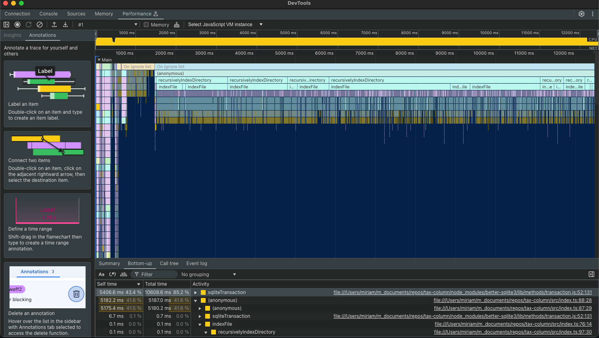

# Thought Log

I almost always write thought logs when I develop. The log is written chronologically (the newest entries are at the bottom).

# Tokenizers

So far I have created a tokenizer function and test. No matter what, I will need a tokenizer.

# Plan

I am going to defer:

- Real-time type-to-search feature
  - The reason I am deferring this is because creating a working full-text search solution is more important than the search interface.
- Using an actual mobile device

First priorities:

- Create basic tokenization ✅
- Process files and tokenize them ✅
- Build a basic inverted index in memory for now (using a smaller dataset) to get a sense of how I could translate this to a disk-based index. ✅

After that is done:

- Storing all of the data in memory isn't an option (makes sense, it doesn't scale). I need to build an index on disk. I could use postgresql or sqlite. Need to consider tradeoffs there but my instinct is to start with sqlite. I can always swap it out for something else later.

# Inverted index finished - next step, disk

I finished the basic inverted index. I know ElasticSearch uses inverted indices so it was useful for me to remind myself how these work again. I want to translate my in-memory inverted index to disk. How can I get multi-token search functionality? Probably need to think of how to query the inverted index (intersections?), but first I need an inverted index on disk.

# Postgresql vs sqlite

- Sqlite
  - Minimal setup complexity
  - Good for read-heavy systems (concerned about the write throughput as data scales, though)
  - Lightweight for mobile
  - Has FTS5 but I'm going to stray away from using something like that since we are discouraged from using out-of-the-box solutions.
- Postgresql
  - Setup is more complex
  - More scalable for massive concurrent writes
  - Requires a backend server, needs internet connection which is a constraint in the specs

I am going to use sqlite because it ticks more of the important boxes.

# better-sqlite3

This isn't supported on mobile, but I can port the solution over to a mobile-compatible sqlite engine. I want to focus on correctness first.

# Phrase matching

Right now, the performance of what I have so far for indexing + querying using sqlite is unknown (I haven't measured it since I am just using the `test_data` dir) and I imagine it's not great because we are processing one file at a time, one token at a time, and conducting one write at a time. I'm guessing for about 100-200MB of data, it would take at least between 1-5 minutes as it is right now (I decided not to sit there for many minutes and test that theory out since time is limited!).

However, before working on optimizing the speed, I want to add one more feature. It doesn't seem useful to only be able to search for individual tokens, so the next thing I need to do is make sure you can search for phrases. This is one of those times where I am going to use AI because I have a vague notion of how to do this, but it will likely take me some time to get the exact query right (I've written enough SQL in my career but not enough to do exact phrase token searches quickly).

My vague notion of how to do this is to add positions to the token_files table for each token, start searching for the first token, and then search that the next position in that file matches the next token in the given phrase.

# Refactor, optimize, or add instant search?

Right now I have a solution that works end-to-end, but it's probably slow. I need to parallelize the text processing/indexing.
I also have some outdated code and naming I could clean up.
Finally, I haven't implemented the "instant search" feature yet.

Which should I do first?

I want to refactor before optimizing because optimizing will add code complexity, so it is better to add complexity to cleaner code.

I would rather have code that is reasonable to read and works than confusing code that is missing one feature, so I will do a really fast refactor and then think about how to add the instant search method.

# Benchmarking

Now that I have some basic prefix searching, I want to think about optimizations.

This is slow!

I ran the `text-search-engine.test.ts` file on the sample data provided by Column Tax, which is 20 MB, and it took 50 wall-clock seconds to finish processing and indexing the text.

My intuition tells me the bottleneck is not in the tokenizing or file reading, but in sqlite transactions.

I ran this profiler command on a test for about 9 seconds:

`node --inspect-brk node_modules/.bin/jest src/text-search-engine.test.ts`

You can see that `sqliteTransaction` is >85% of total time.

The main bottleneck for building the index is sqlite.
