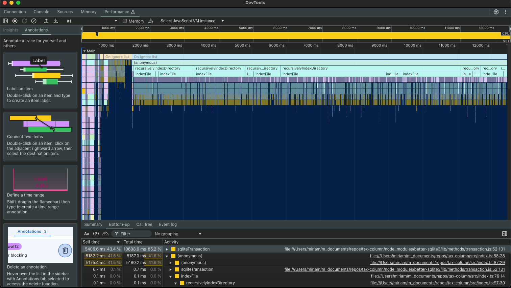

# Summary of Tradeoffs

You can view more detailed and less structured records of my decision-making in `thought_log.md`.

## Database Choice: Postgresql vs sqlite

If I had more time, I would have thought more about this and included more DB options in my evaluation, but I wanted to reach for DBs I was comfortable/had used before.

- Sqlite
  - Minimal setup complexity
  - Good for read-heavy systems (concerned about the write throughput as data scales, though)
  - Lightweight for mobile
  - Has FTS5 but I'm going to stray away from using something like that since we are discouraged from using out-of-the-box solutions.
- Postgresql
  - Setup is more complex
  - More scalable for massive concurrent writes
  - Requires a backend server, needs internet connection which is a constraint in the specs

**Decision:** SQLite was chosen because it aligns better with the project’s constraints and goals.

## Prefix searching/auto-complete deprioritized

I decided to cover prefix searching last, and I never got to fully flesh it out into full-phrase prefix searching. The reason I did this is because creating an end-to-end solution that works seemed more important than autocomplete, and I thought it would be easier to add autocomplete to an already working solution than to start with it.

## Performance Bottlenecks and Optimizations

This is pretty slow and we would need to speed it up for it to be usable in a production environment.

- Profiling showed that `sqliteTransaction` accounted for **85%+ of total execution time**
- The indexing process was slow, taking **50 seconds for 20MB of data**
- The main issue was excessive small writes, each in a separate transaction

### Optimizations

Here is how I would start optimizing.

1. Batch inserts instead of single writes
2. Write-Ahead logging to improve concurrent read/write
3. Parallelized file processing: if we could use workers on separate machines that are responsible for different chunks of the files, and then create a job to merge the DBs, the client could download that merged DB
